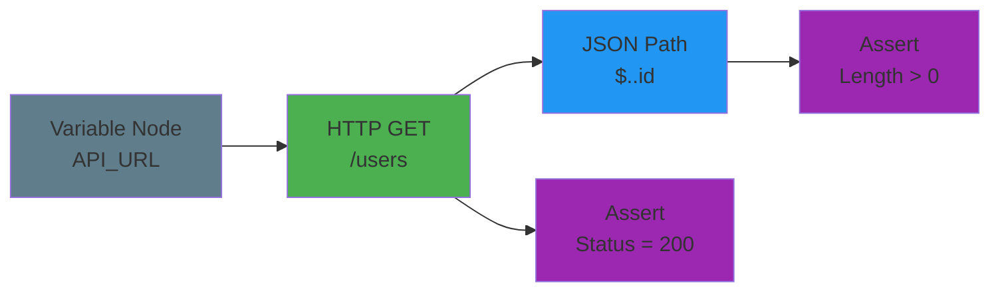
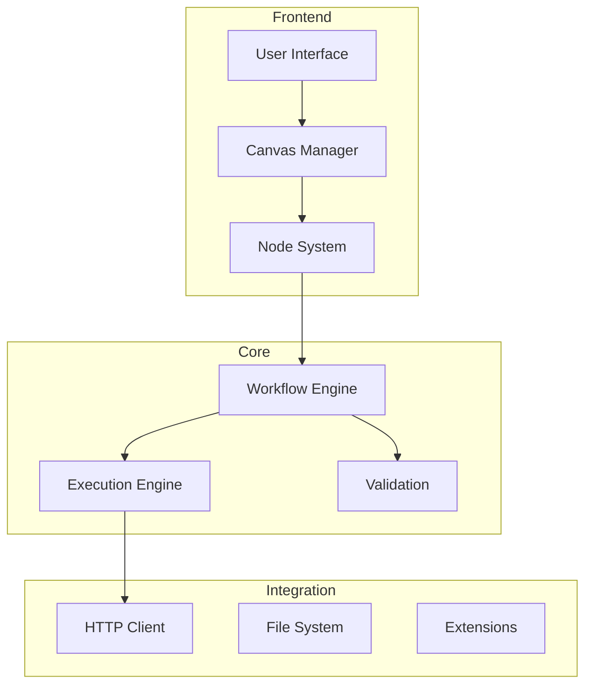

<h1 align="center">MagicAPI - Visual API Flow Designer</h1>

<p align="center">
  <strong>Design, test, and manage API workflows visually with an intuitive node-based interface</strong>
</p>

<p align="center">
  
  
  
  
  
</p>

<p align="center">
  <a href="#-features">Features</a> •
  <a href="#-getting-started">Getting Started</a> •
  <a href="#-screenshots">Screenshots</a> •
  <a href="#-architecture">Architecture</a> •
  <a href="#-contributing">Contributing</a>
</p>

MagicAPI is a powerful visual programming tool for designing, testing, and managing API workflows. Built with Electron and TypeScript, it provides an intuitive node-based interface for creating complex API integrations without writing code.

<p align="center">
  
  <br>
  <em>Visual node-based API workflow designer with dark theme</em>
</p>

## 🎆 Why MagicAPI?

<table>
  <tr>
    <th>Feature</th>
    <th>MagicAPI</th>
    <th>Postman</th>
    <th>Insomnia</th>
  </tr>
  <tr>
    <td>Visual Workflow Designer</td>
    <td>✅ Built-in</td>
    <td>🚧 Limited</td>
    <td>❌ No</td>
  </tr>
  <tr>
    <td>Infinite Canvas</td>
    <td>✅ Yes</td>
    <td>❌ No</td>
    <td>❌ No</td>
  </tr>
  <tr>
    <td>Node-Based Logic</td>
    <td>✅ Full</td>
    <td>🚧 Basic</td>
    <td>❌ No</td>
  </tr>
  <tr>
    <td>Open Source</td>
    <td>✅ Yes</td>
    <td>❌ No</td>
    <td>✅ Yes</td>
  </tr>
  <tr>
    <td>Cross-Platform</td>
    <td>✅ Yes</td>
    <td>✅ Yes</td>
    <td>✅ Yes</td>
  </tr>
</table>

## 🌟 Features

### Core Functionality
- **Visual Node-Based Editor**: Drag-and-drop interface for building API workflows
- **Infinite Canvas**: Pan, zoom, and navigate through large workflows with ease
- **Real-Time Execution**: Run and test your API workflows directly within the application
- **Smart Node System**: Pre-built nodes for common operations with extensibility support

### Node Types
- **HTTP Requests**: GET, POST, PUT, DELETE, PATCH with full configuration
- **Data Transformation**: JSON path extraction, string manipulation, data mapping
- **Control Flow**: Conditions, loops, parallel execution
- **Testing & Validation**: Assertions, response validators, schema checking
- **Utilities**: Variables, constants, custom JavaScript functions

### Advanced Features
- **Environment Management**: Switch between dev, staging, and production environments
- **Authentication Support**: Bearer tokens, Basic auth, OAuth, API keys
- **Import/Export**: Compatible with Postman collections and OpenAPI specs
- **Version Control**: Git-friendly workflow files
- **Real-time Collaboration**: (Coming soon)

## 🚀 Getting Started

### Prerequisites
- Node.js 16.0 or higher
- npm or yarn
- Git

### Installation

1. Clone the repository:
```bash
git clone https://github.com/manojmaheshwarjg/MagicAPI.git
cd MagicAPI
```

2. Install dependencies:
```bash
npm install
```

3. Build the application:
```bash
npm run build
```

4. Run MagicAPI:
```bash
npm start
```

### Development Mode

For development with hot-reload:
```bash
npm run dev
```

## 📖 Usage

### Creating Your First Workflow

1. **Add Nodes**: Drag nodes from the palette on the left to the canvas
2. **Connect Nodes**: Click and drag from output ports to input ports
3. **Configure Nodes**: Click on a node to see its properties in the right panel
4. **Run Workflow**: Press F5 or click the Run button in the toolbar

## 🎥 Quick Demo

### Example: Testing a REST API



This workflow:
1. Sets the API base URL
2. Makes a GET request to `/users`
3. Extracts all user IDs from the response
4. Asserts that users were returned
5. Validates the HTTP status code

### Keyboard Shortcuts

- `Ctrl/Cmd + N`: New workflow
- `Ctrl/Cmd + O`: Open workflow
- `Ctrl/Cmd + S`: Save workflow
- `F5`: Run workflow
- `Ctrl/Cmd + Z`: Undo
- `Ctrl/Cmd + Shift + Z`: Redo
- `Delete`: Delete selected nodes
- `Ctrl/Cmd + Mouse Wheel`: Zoom in/out

## 📸 Screenshots

<table>
  <tr>
    <td width="50%">
      
      <p align="center"><em>Drag-and-drop node palette</em></p>
    </td>
    <td width="50%">
      
      <p align="center"><em>Visual workflow on infinite canvas</em></p>
    </td>
  </tr>
  <tr>
    <td width="50%">
      
      <p align="center"><em>Configure node properties</em></p>
    </td>
    <td width="50%">
      
      <p align="center"><em>Real-time execution logs</em></p>
    </td>
  </tr>
</table>

## 🏗️ Architecture

MagicAPI is built with a modular architecture. For detailed architecture documentation, see [Architecture Documentation](docs/ARCHITECTURE.md).

### High-Level Architecture



### Key Components

- **Node System**: Extensible node architecture with TypeScript interfaces
- **Canvas Manager**: Infinite canvas with pan, zoom, and grid snap
- **Workflow Engine**: Graph-based execution with parallel processing
- **Type System**: Strong typing for data flow between nodes
- **Plugin Architecture**: Easy extension with custom nodes

## 🛠️ Building from Source

### Windows
```bash
npm run package
```

### macOS
```bash
npm run package
```

### Linux
```bash
npm run package
```

The packaged application will be in the `build/` directory.

## 🤝 Contributing

We welcome contributions! Please see our [Contributing Guide](CONTRIBUTING.md) for details.

### Development Setup

1. Fork the repository
2. Create a feature branch (`git checkout -b feature/amazing-feature`)
3. Commit your changes (`git commit -m 'Add amazing feature'`)
4. Push to the branch (`git push origin feature/amazing-feature`)
5. Open a Pull Request

## 📝 Roadmap

- [ ] Connection system with bezier curves
- [ ] Workflow execution engine
- [ ] File save/load functionality
- [ ] HTTP request implementation
- [ ] Data transformation nodes
- [ ] Testing framework integration
- [ ] Plugin system for custom nodes
- [ ] Real-time collaboration
- [ ] Cloud sync and sharing
- [ ] AI-powered workflow suggestions

## 📄 License

This project is licensed under the MIT License - see the [LICENSE](LICENSE) file for details.

## 🙏 Acknowledgments

- Built with [Electron](https://www.electronjs.org/)
- UI inspired by modern node-based editors
- Icons from [Material Design Icons](https://materialdesignicons.com/)

## 📧 Contact

- GitHub Issues: [Report bugs or request features](https://github.com/manojmaheshwarjg/MagicAPI/issues)
- Email: manojmaheshwarjg@gmail.com

---

<p align="center">Made with ❤️ by the MagicAPI Team</p>
