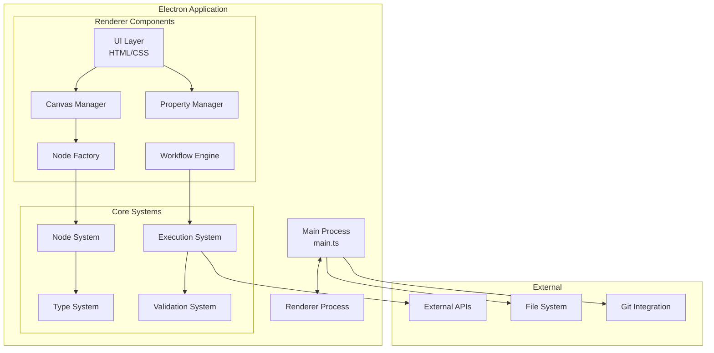
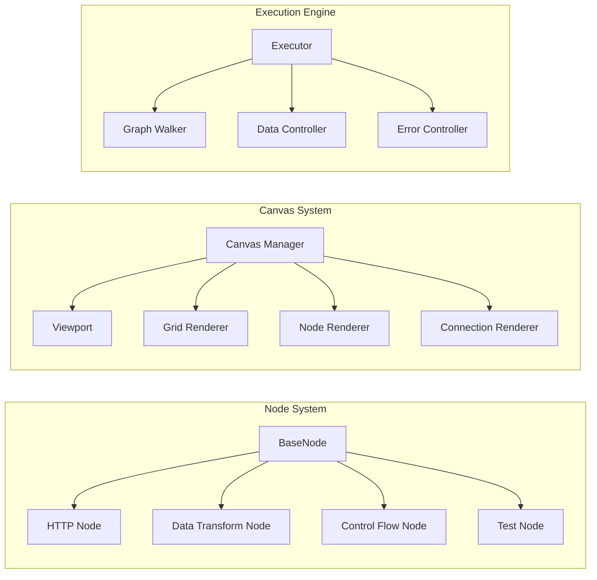
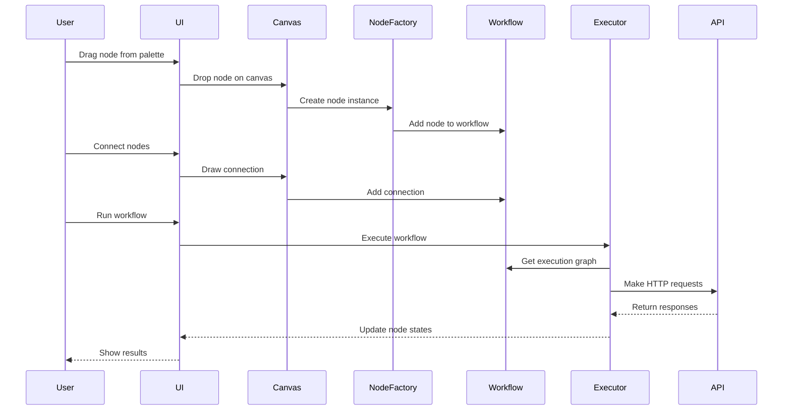

# MagicAPI Architecture

## System Overview



## Component Architecture



## Data Flow Architecture



## Directory Structure

```
MagicAPI/
├── src/
│   ├── main.ts              # Electron main process
│   ├── core/                # Core business logic
│   │   ├── types.ts         # TypeScript type definitions
│   │   ├── NodeFactory.ts   # Node creation and management
│   │   └── WorkflowEngine.ts # Workflow execution logic
│   └── renderer/            # Renderer process (UI)
│       ├── index.html       # Main HTML file
│       ├── canvas/          # Canvas management
│       │   └── CanvasManager.ts
│       ├── components/      # UI components
│       │   ├── NodePalette.ts
│       │   ├── PropertyPanel.ts
│       │   └── Console.ts
│       ├── nodes/           # Node implementations
│       │   ├── HttpNode.ts
│       │   ├── DataNode.ts
│       │   └── TestNode.ts
│       ├── scripts/         # Main application scripts
│       │   └── app.ts
│       └── styles/          # CSS styles
│           ├── main.css
│           ├── canvas.css
│           ├── nodes.css
│           └── panels.css
├── docs/                    # Documentation
│   ├── images/             # Screenshots and diagrams
│   └── ARCHITECTURE.md     # This file
├── test/                   # Test files
├── dist/                   # Compiled output
└── build/                  # Packaged applications
```

## Technology Stack

### Frontend
- **Framework**: Electron v28.0.0
- **Language**: TypeScript v5.3.0
- **Canvas**: HTML5 Canvas with hardware acceleration
- **Styling**: Custom CSS with CSS Variables for theming

### Core Libraries
- **HTTP Client**: Axios for API requests
- **Data Manipulation**: JSONPath for data extraction
- **Utilities**: Lodash for data operations
- **ID Generation**: UUID for unique identifiers

### Development Tools
- **Build System**: TypeScript Compiler
- **Package Manager**: npm
- **Bundler**: Electron Builder
- **Linting**: ESLint with TypeScript support
- **Testing**: Jest (configured)

## Design Patterns

### 1. Factory Pattern
Used for node creation, allowing easy extension of node types.

```typescript
class NodeFactory {
    static registerNodeType(definition: NodeTypeDefinition)
    static createNode(type: string, position: Point): BaseNode
}
```

### 2. Observer Pattern
Canvas and workflow events use event emitters for loose coupling.

```typescript
canvasManager.on('canvas:click', (pos) => handleClick(pos));
canvasManager.on('viewport:change', (viewport) => updateMinimap(viewport));
```

### 3. Command Pattern
For undo/redo functionality (to be implemented).

### 4. Strategy Pattern
Different node executors implement the same interface.

## Security Considerations

1. **Context Isolation**: Disabled for direct Node.js access (consider enabling with preload scripts)
2. **HTTPS Only**: API requests default to HTTPS
3. **Credential Storage**: Sensitive data encrypted in environment variables
4. **Input Validation**: All user inputs validated before execution

## Performance Optimizations

1. **Canvas Rendering**
   - Hardware acceleration via WebGL
   - Viewport culling for large workflows
   - Dirty rectangle optimization

2. **Memory Management**
   - Stream processing for large datasets
   - Lazy loading of node definitions
   - Efficient data structures for graph traversal

3. **Execution**
   - Parallel execution of independent branches
   - Request pooling and rate limiting
   - Response caching with TTL

## Future Extensibility

### Plugin System
- Dynamic node type registration
- Custom UI themes
- External tool integrations

### Collaboration
- WebRTC for real-time collaboration
- Operational Transformation for conflict resolution
- Presence awareness

### Cloud Features
- Workflow storage and sharing
- Team workspaces
- Execution history and analytics
